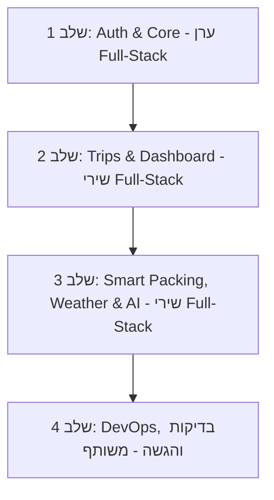

# 🚀 תוכנית עבודה לפיתוח Packing App (Sprint Plan)

**צוות הפיתוח:** ערן & שירי  
**מנחה טכנולוגי (Tech Lead):** Antigravity AI  
**ענף עבודה ראשי:** `main`

---

## 🎯 יעדי הפרויקט
1. בניית אפליקציית Full-Stack שלמה לניהול חכם של רשימות אריזה לחופשות.
2. התנסות בפיתוח **רוחבי (Full-Stack per Feature)** – כל מפתח מוביל פיצ'רים שלמים מקצה לקצה: ממסד הנתונים וה-API ועד ממשק המשתמש ב-React.
3. שילוב תחזית מזג אוויר בזמן אמת, בינה מלאכותית, והתאמת כבודה לפי חוקי חברות תעופה.

---

## 👥 חלוקת תפקידים ופיצ'רים רוחבית (Full-Stack Division)

### 👤 תחום האחריות של ערן (`kamper83-stack`):
* **פיצ'ר אימות ואבטחה מקצה לקצה (Auth Full-Stack):**
  * **Backend (Issue #4):** מודל `User`, הצפנת סיסמאות ב-`bcrypt`, טוקן `JWT`, נתיבי הרשמה/התחברות ובדיקות Jest.
  * **Frontend (Issue #5):** מסכי `Login.jsx` ו-`Signup.jsx`, שמירת הטוקן ב-`localStorage`, וניהול ניתוב מוגן (`ProtectedRoute`).
* **ארכיטקטורה, תשתית ו-DevOps:**
  * **Issue #2:** שלד השרת ב-Express, חיבור SQLite ו-Sequelize.
  * **Issue #11:** הגדרת צינור בדיקות אוטומטי (CI Actions Pipeline).
  * **Issue #12:** קונפיגורציית Dockerfiles ו-`docker-compose.yml`.
  * **Issue #13:** פריסה אוטומטית (CD Deployment Pipeline).

### 👤 תחום האחריות של שירי (`shirikyky`):
* **פיצ'ר ניהול נסיעות מקצה לקצה (Trips Full-Stack):**
  * **Backend (Issue #6):** מודלים `Trip` ו-`PackingItem`, נתיבי CRUD ליצירת נסיעה, שליפת נסיעות ועדכון פריטים.
  * **Frontend (Issue #9):** מסך `Dashboard.jsx` וטופס יצירת נסיעה חדשה עם בחירת יעד, תאריכים וחברת תעופה.
* **פיצ'ר אריזה חכמה, מזג אוויר ו-AI (Smart Packing Full-Stack):**
  * **UI/UX (Issue #3):** הגדרת Tailwind CSS v3 ועיצוב הבסיס.
  * **Services (Issue #7 & #8):** שירות מזג אוויר (`weatherService.js`) ושירות בינה מלאכותית (`geminiService.js`) כולל מצבי Mock.
  * **Frontend (Issue #10):** מסך רשימת האריזה (`TripView.jsx`) – סימון פריטים, מיון לפי מזוודה/תיק גב, התראות מזג אוויר וחיווי כבודה.

---

## 📋 תוכנית השלבים (Milestones & Roadmap)

---

### 🔹 שלב 1: אימות משתמשים מלא (ערן - Full-Stack Auth)
* [x] **[Issue #4 - Backend]:** מודל `User`, הצפנת `bcrypt`, טוקן `JWT`, נתיבי `/api/auth/register`, `/api/auth/login`, ובדיקות אינטגרציה (נשלח ב-PR #16).
* [ ] **[Issue #5 - Frontend]:** חיבור מסכי `Login.jsx` ו-`Signup.jsx` ל-API, שמירת הטוקן וניהול ניתוב מוגן (`ProtectedRoute`).

---

### 🔹 שלב 2: ניהול נסיעות ודשבורד (שירי - Full-Stack Trips)
* [ ] **[Issue #6 - Backend]:** מודל `Trip` ומודל `PackingItem` עם קשרים (`User hasMany Trips`, `Trip hasMany PackingItems`), ונתיבי ניהול נסיעות.
* [ ] **[Issue #9 - Frontend]:** בניית דף ה-`Dashboard.jsx` וטופס פתיחת נסיעה חדשה.

---

### 🔹 שלב 3: אריזה חכמה, מזג אוויר ובינה מלאכותית (שירי - Full-Stack Smart Packing)
* [x] **[Issue #3 - UI]:** הגדרת Tailwind CSS (הושלם ונסגר).
* [ ] **[Issue #7 & #8 - Services]:** אינטגרציה של WeatherAPI ומודל AI לגנרוט רשימות אריזה לפי יעד.
* [ ] **[Issue #10 - Frontend]:** בניית `TripView.jsx` – צ'קליסט אינטראקטיבי, ווידג'ט מזג אוויר צבעוני, וחלוקה לפי סוגי מזוודות.

---

### 🔹 שלב 4: אינטגרציה, DevOps והגשה (ערן & שירי)
* [ ] בדיקות מקצה לקצה (CI Pipeline ירוק).
* [ ] אימות העלאת הקונטיינרים ב-Docker Compose.
* [ ] הכנת הדגמה סופית לפרויקט הגמר.

---

## 🛠️ כללי עבודה כצוות (Git Workflow)
1. **עבודה בענפי פיצ'ר ייעודיים**:
   * פורמט שמות ענפים: `feature/issue-<num>-<description>` (לדוגמה: `feature/issue-5-auth-ui`).
2. **Pull Requests ו-Code Review הדדי**:
   * כל PR שנפתח על ידי ערן דורש אישור ובדיקה של שירי לפני מיזוג ל-`main`, וכל PR של שירי נבדק ומאושר על ידי ערן.
3. **CI ירוק חובה**:
   * שום ענף לא ממוזג ל-`main` ללא מעבר מלא של כל הבדיקות האוטומטיות.
