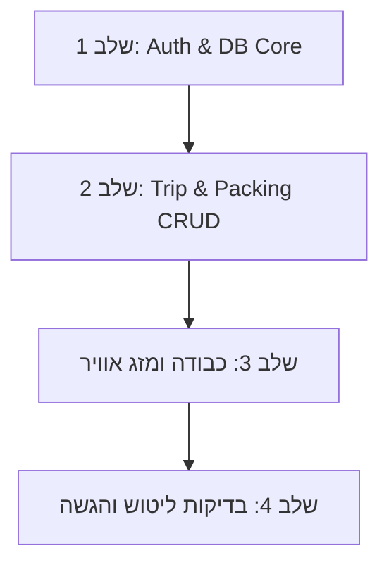

# 🚀 תוכנית עבודה לפיתוח Packing App (Sprint Plan)

**צוות הפיתוח:** ערן & שירי  
**מנחה טכנולוגי (Tech Lead):** Antigravity AI  
**ענף עבודה ראשי:** `main`

---

## 🎯 יעדי הפרויקט
1. בניית אפליקציית Full-Stack שלמה לניהול חכם של רשימות אריזה לחופשות.
2. תרגול מעשי של React, Express, SQLite/Sequelize, JWT Authentication, ו-API חיצוני.
3. שילוב תחזית מזג אוויר בזמן אמת והתאמת כבודה לפי חוקי חברות תעופה.

---

## 👥 חלוקת תפקידים ואחריות

### 🛠️ ערן – Backend & Architecture Lead
* הגדרת מסד הנתונים וה-Models (Sequelize / SQLite).
* פיתוח שרת ה-Express ו-RESTful APIs.
* אבטחה ואימות: הצפנת סיסמאות (`bcrypt`), הנפקת `JWT` ו-Auth Middleware.
* אינטגרציה עם Weather API / Mock Service.
* שירות לחישוב מגבלות משקל וממדי כבודה לפי חברת התעופה.

### 🎨 שירי – Frontend & UI/UX Lead
* בניית ממשק המשתמש ב-React וב-Tailwind CSS.
* ניהול State מקומי וגלובלי (React Hooks, Context / LocalStorage).
* מסכי Auth: התחברות והרשמה עם ניתוב מוגן (`ProtectedRoute`).
* מסך הדשבורד וטפסי יצירת נסיעה חדשה.
* מסך רשימת אריזה אינטראקטיבי (סימון פריטים, חלוקה לפי מזוודות/קטגוריות).
* הצגת ווידג'ט מזג אוויר והתראות אריזה חכמות.

---

## 📋 תוכנית השלבים (Milestones & Sprints)

---

### 🔹 שלב 1: תשתית ואימות משתמשים (Auth & Core DB)
* **ערן (Backend):** 
  * [Issue #4]: מימוש מודל `User` ב-Sequelize, יצירת נתיבי `/api/auth/register` ו-`/api/auth/login`.
  * הצפנת סיסמאות עם `bcrypt` והחזרת JWT Token.
* **שירי (Frontend):**
  * [Issue #5]: בניית קומפוננטות `Login.jsx` ו-`Signup.jsx` עם טפסים ו-Validation.
  * שמירת ה-Token ב-`localStorage` והגדרת `ProtectedRoute` ב-React Router.
* **משימה משותפת:** בדיקה ידנית שהרשמה והתחברות עובדות מקצה לקצה.

---

### 🔹 שלב 2: ניהול נסיעות ופריטי אריזה (Trips & Packing CRUD)
* **ערן (Backend):**
  * [Issue #6]: יצירת מודלים `Trip` ו-`PackingItem` עם קשרים (`User hasMany Trips`, `Trip hasMany PackingItems`).
  * יצירת REST Endpoints: קבלת נסיעות, יצירת נסיעה, הוספת פריט, ועדכון סטטוס `isPacked`.
* **שירי (Frontend):**
  * [Issue #9]: בניית ה-`Dashboard.jsx` – תצוגת כרטיסי נסיעה וטופס יצירת נסיעה חדשה (יעד, תאריכים, חברת תעופה).
  * [Issue #10]: בניית `TripView.jsx` – תצוגת רשימת הפריטים עם Checkboxes, חלוקה לקטגוריות והוספת פריט ידני.

---

### 🔹 שלב 3: חוקי כבודה ומזג אוויר (Airlines & Weather Integration) 🌦️✈️
* **ערן (Backend):**
  * [Issue #7]: שירות מזג אוויר מול Weather API המחזיר תחזית ליעד לפי תאריכי הנסיעה.
  * שילוב נתוני מגבלות כבודה לפי חברת התעופה שנבחרה.
* **שירי (Frontend):**
  * הצגת ווידג'ט מזג אוויר צבעוני בתוך דף הנסיעה (`TripView`).
  * הצגת חיווי משקל/מגבלות כבודה והתראות אריזה חכמות (למשל: "צפוי גשם ביעד - מומלץ לארוז מטרייה ומעיל!").

---

### 🔹 שלב 4: ליטוש, בדיקות והגשה (Polishing & Testing) 🎯
* בדיקות יחידה מקצה לקצה (CI Pipeline ירוק).
* שיפורי רספונסיביות ו-Accessibility (a11y).
* הכנת הדגמה (Demo) להגשת פרויקט הסיום.

---

## 🛠️ כללי עבודה כצוות (Git Workflow)
1. **לא דוחפים ישירות ל-`main`**:
   * ערן פותח ענף: `feature/eran-backend`
   * שירי פותחת ענף: `feature/shiri-frontend`
2. **Code Review ומנטורינג:**
   * כשאתם מסיימים משימה, אתם מבקשים ממני (המנטור) לעשות לכם Code Review.
   * אני אעבור על הקוד, אצביע על דגשים (אבטחה, יעילות, Clean Code) ואאשר לכם למזג.
